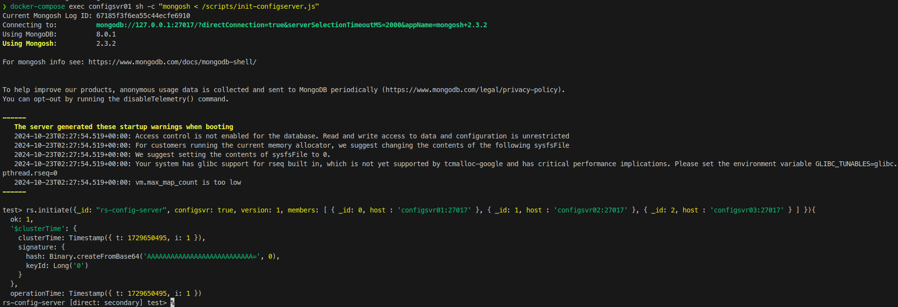
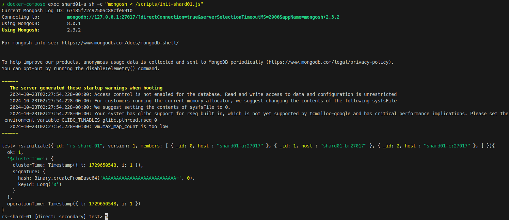
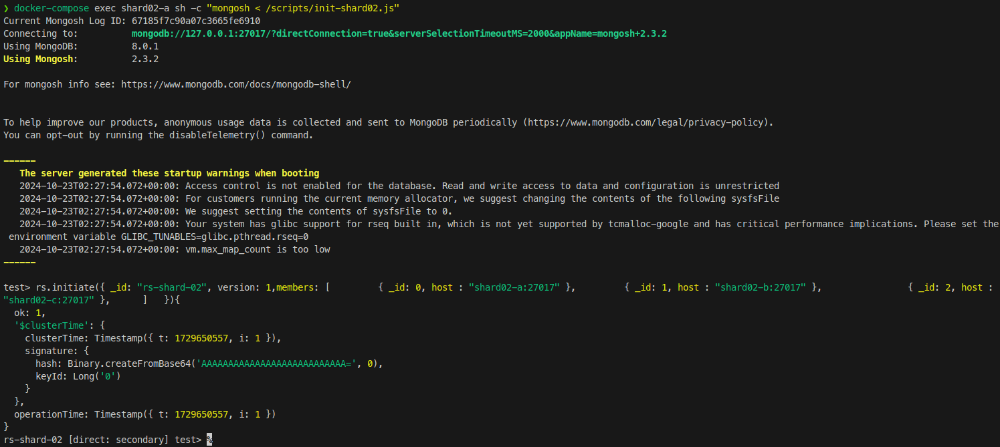
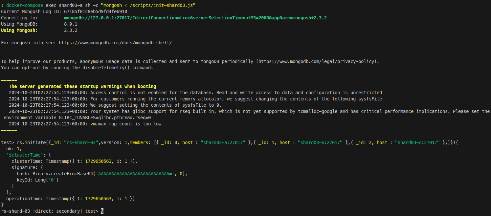
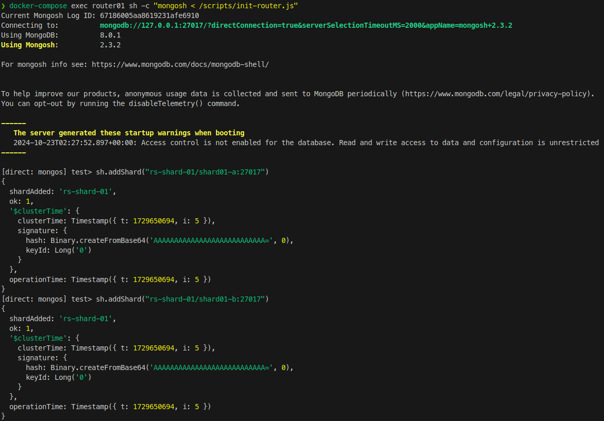
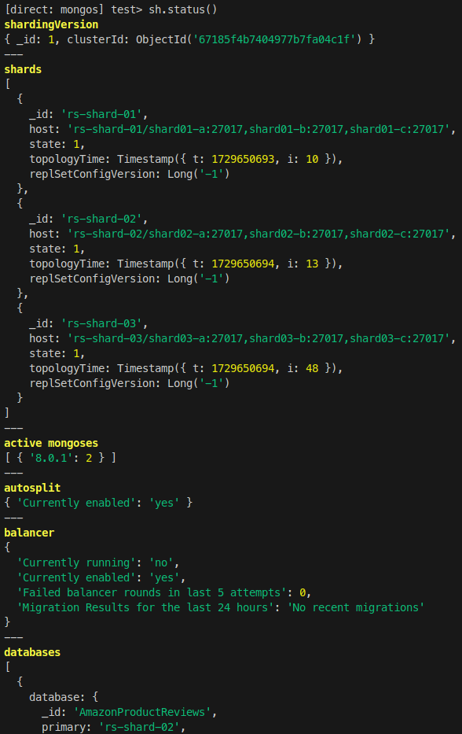
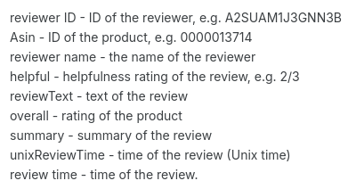
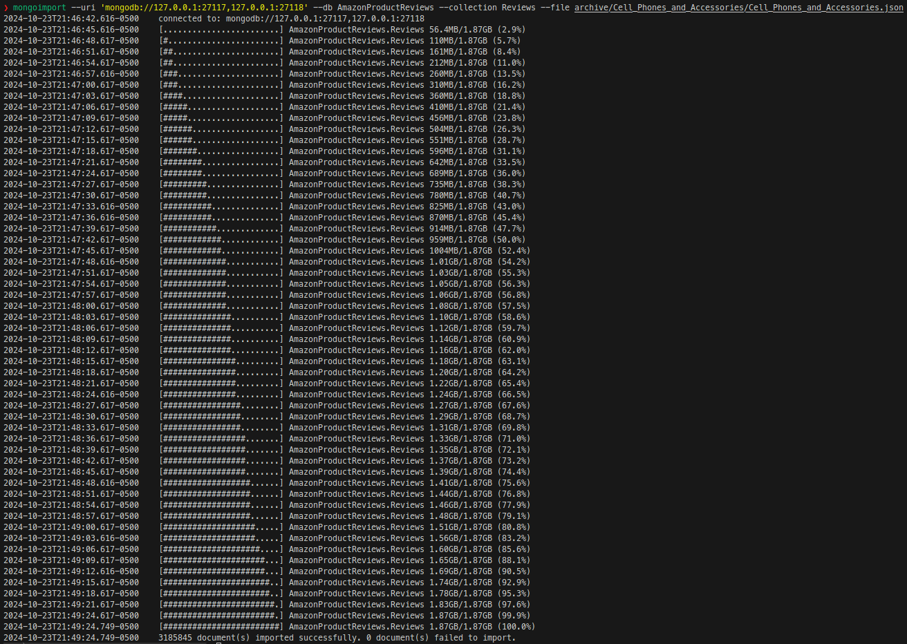

# MongoDB Sharded Cluster

## Requisitos

- Distribución de GNU/Linux
- Docker
- docker-compose

## Pasos para implementar

1. Levantar todos los contenedores

   ```bash
   docker-compose up -d
   ```
2. Inicializar los Replica Sets para los servidores de configuración y Shards

   ```bash
   docker-compose exec configsvr01 sh -c "mongosh < /scripts/init-configserver.js"

   docker-compose exec shard01-a sh -c "mongosh < /scripts/init-shard01.js"
   docker-compose exec shard02-a sh -c "mongosh < /scripts/init-shard02.js"
   docker-compose exec shard03-a sh -c "mongosh < /scripts/init-shard03.js"
   ```
   

   

   

   

3. Inicialización del enrutador.

   ```bash
   docker-compose exec router01 sh -c "mongosh < /scripts/init-router.js"
   ```

   

4. Habilitación del sharding configuración de la llave de sharding

   ```bash
   docker-compose exec router01 mongosh --port 27017

   sh.enableSharding("AmazonProductReviews")

   db.adminCommand( { shardCollection: "AmazonProductReviews.Reviews", key: { asin: "hashed", category: 1, reviewerID: 1 }, numInitialChunks: 3 } )

   ```
5. Verificación de la implementación

   La cadena de conexión para conectar al cluster de mongo es el siguiente

   ```bash
   mongodb://127.0.0.1:27117,127.0.0.1:27118
   ```
   Verificar el estado del Sharded Cluster

   ```bash
   docker-compose exec router01 mongosh --port 27017
   sh.status()
   ```
   

6. Verificación del estado de cada Replica Set para cada Shard

   ```bash
   docker exec -it shard-01-node-a bash -c "echo 'rs.status()' | mongosh --port 27017" 
   docker exec -it shard-02-node-a bash -c "echo 'rs.status()' | mongosh --port 27017" 
   docker exec -it shard-03-node-a bash -c "echo 'rs.status()' | mongosh --port 27017" 
   ```
7. Verificar el estado de la base de datos

   ```bash
   docker-compose exec router01 mongosh --port 27017
   use AmazonProductReviews
   db.stats()
   db.Reviews.getShardDistribution()
   ```
8. Comandos adicionales para verficar las configuraciones

   ```bash
   docker exec -it mongo-config-01 bash -c "echo 'rs.status()' | mongosh --port 27017"


   docker exec -it shard-01-node-a bash -c "echo 'rs.help()' | mongosh --port 27017"
   docker exec -it shard-01-node-a bash -c "echo 'rs.status()' | mongosh --port 27017" 
   docker exec -it shard-01-node-a bash -c "echo 'rs.printReplicationInfo()' | mongosh --port 27017" 
   docker exec -it shard-01-node-a bash -c "echo 'rs.printSlaveReplicationInfo()' | mongosh --port 27017"
   ```
9. Datos

   

   

   ### Inserción de los datos

   

10. Casos de Uso

   ## Busquedas
   
   ### Filtrado de reseñas positivas y negativas.

   ```javascript
   db.Reviews.find({ overall: { $gte: 4 } }).pretty()
   db.Reviews.find({ overall: { $lte: 2 } }).pretty()

   ```

   ### Busqueda por palabras clave específicas.

   ```javascript
   db.Reviews.createIndex({ reviewText: "text" })
   db.Reviews.find({ $text: { $search: "phone case" } })
   ```

   ## Agregaciones

   ### Contabilizar la cantidad de reseñas por cada calificación

   ```javascript
   db.Reviews.aggregate([
   { $group: { _id: "$overall", count: { $sum: 1 } } },
   { $sort: { _id: 1 } }
   ])
   ```

   ### Calcular el promedio de calificación por cada producto.

   ```javascript
   db.Reviews.aggregate([
   { $group: { _id: "$asin", avgRating: { $avg: "$overall" } } },
   { $sort: { avgRating: -1 } }
   ])
   ```

   ### Encontrar productos con más reseñas útiles.

   ```javascript
   db.Reviews.aggregate([
   { $addFields: { helpfulScore: { $subtract: [ { $arrayElemAt: ["$helpful", 0] }, { $arrayElemAt: ["$helpful", 1] } ] } } },
   { $sort: { helpfulScore: -1 } }
   ])
   ```

   ## Análisis

   ### Mostrar la cantidad de reseñas por año o mes

   ```javascript
   db.Reviews.aggregate([
   { $addFields: { reviewYear: { $year: { $toDate: "$unixReviewTime" } } } },
   { $group: { _id: "$reviewYear", count: { $sum: 1 } } },
   { $sort: { _id: 1 } }
   ])
   ```

   ### Frecuencia de palabras

   ```javascript
   db.Reviews.aggregate([
   { $match: { $text: { $search: "quality" } } },
   { $count: "reviewsContainingQuality" }
   ])
   ```

   ## Pipeline de Agregación

   ### Agrupar las reseñas positivas por cada producto, calcular la calificación promedio, ordena los productios por el número total de reseñas y mostrar los 10 productios con más reseñas

   ```javascript
   db.Reviews.aggregate([
   { $match: { overall: { $gte: 4 } } },
   { $group: { _id: "$asin", avgRating: { $avg: "$overall" }, totalReviews: { $sum: 1 } } },
   { $sort: { totalReviews: -1 } },
   { $limit: 10 }
   ])
   ```

   ## Map Reduce

   ### Promedio de calificaciones por producto

   ```javascript
   // Función Map: Emitir cada producto con su calificación
   var mapFunction = function() {
      emit(this.asin, { sum: this.overall, count: 1 });
   };

   // Función Reduce: Sumar las calificaciones y contar reseñas
   var reduceFunction = function(key, values) {
      var result = { sum: 0, count: 0 };
      values.forEach(function(value) {
         result.sum += value.sum;
         result.count += value.count;
      });
      return result;
   };

   // Función Finalize: Calcular el promedio
   var finalizeFunction = function(key, reducedValue) {
      reducedValue.avg = reducedValue.sum / reducedValue.count;
      return reducedValue;
   };

   // Ejecutar el map-reduce en la colección Reviews
   db.Reviews.mapReduce(
      mapFunction,
      reduceFunction,
      {
         out: "promedio_calificaciones_producto",
         finalize: finalizeFunction
      }
   );
   ```

   Consultamos los datos

   ```javascript
   db.promedio_calificaciones_producto.find().pretty()
   ```
